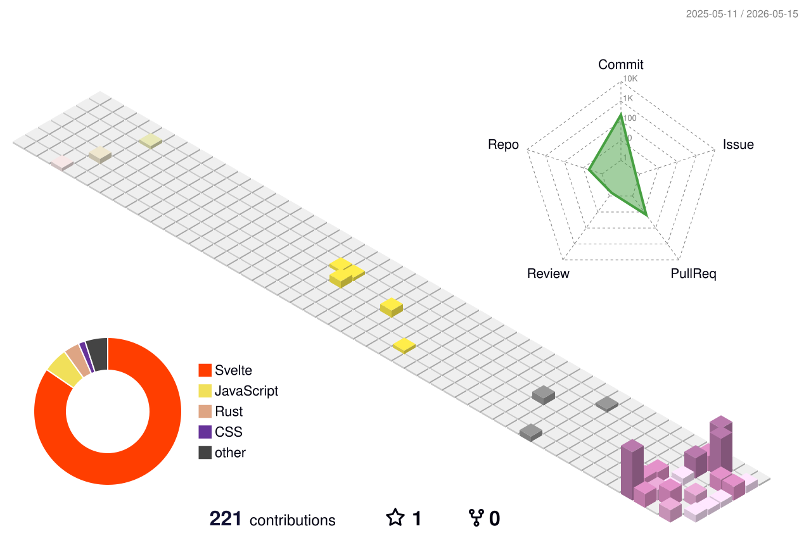

<div align="center">

<!-- Typing SVG アニメーション -->
<a href="https://git.io/typing-svg">
  
</a>

<br/>

<!-- プロフィールビュー数 -->


</div>

---

## 👨‍💻 About Me

```javascript
const kaikai_kitan = {
  pronouns:  "He | Him",
  location:  "Japan 🇯🇵",
  passion:   ["Creative Coding", "Motion Design", "Interactive Media"],
  hobbies:   ["Unity Dev", "Video Editing", "Arduino Hacking"],
  currently: "Always building something new ✨"
};
```

---

## 🛠️ Tech Stack & Tools

### 💻 Languages
<p>
  
  
  
  
  
  
</p>

### 🎮 Game & Creative Tools
<p>
  
  
  
</p>

### 🎬 Video & Motion
<p>
  
  
  
  
</p>

### ⚙️ DevOps & Others
<p>
  
  
  
  
</p>

---

## 📊 GitHub Stats

<div align="center">

<p>
  <picture>
    <source media="(prefers-color-scheme: dark)"  srcset="https://github-readme-stats.vercel.app/api?username=kaikai-kitan&show_icons=true&locale=ja&theme=tokyonight&hide_border=true" width="400" />
    <source media="(prefers-color-scheme: light)" srcset="https://github-readme-stats.vercel.app/api?username=kaikai-kitan&show_icons=true&locale=ja&theme=default&hide_border=true" width="400" />
    
  </picture>
  <picture>
    <source media="(prefers-color-scheme: dark)"  srcset="https://github-readme-stats.vercel.app/api/top-langs?username=kaikai-kitan&show_icons=true&locale=ja&layout=compact&theme=tokyonight&hide_border=true" width="340" />
    <source media="(prefers-color-scheme: light)" srcset="https://github-readme-stats.vercel.app/api/top-langs?username=kaikai-kitan&show_icons=true&locale=ja&layout=compact&theme=default&hide_border=true" width="340" />
    
  </picture>
</p>

<!-- GitHub トロフィー -->
<picture>
  <source media="(prefers-color-scheme: dark)"  srcset="https://github-profile-trophy.vercel.app/?username=kaikai-kitan&theme=tokyonight&no-bg=true&no-frame=true&row=1" />
  <source media="(prefers-color-scheme: light)" srcset="https://github-profile-trophy.vercel.app/?username=kaikai-kitan&theme=flat&no-bg=true&no-frame=true&row=1" />
  
</picture>

</div>

---

## 🌐 3D Contribution Graph

<div align="center">
  <picture>
    <source media="(prefers-color-scheme: dark)"  srcset="profile-3d-contrib/profile-night-rainbow.svg" width="100%" />
    <source media="(prefers-color-scheme: light)" srcset="profile-3d-contrib/profile-season-animate.svg" width="100%" />
    
  </picture>
</div>

---

## 📈 Activity & Metrics

<div align="center">
  <picture>
    <source media="(prefers-color-scheme: dark)"  srcset="output/metrics.svg" width="100%" />
    <source media="(prefers-color-scheme: light)" srcset="output/metrics.svg" width="100%" />
    
  </picture>
</div>

---

## 🐍 Contribution Snake

<div align="center">
  <picture>
    <source media="(prefers-color-scheme: dark)"  srcset="output/github-snake-dark.svg" />
    <source media="(prefers-color-scheme: light)" srcset="output/github-snake.svg" />
    
  </picture>
</div>

---

<div align="center">
  <i>✨ "Code is art. Build something beautiful." ✨</i>
</div>
